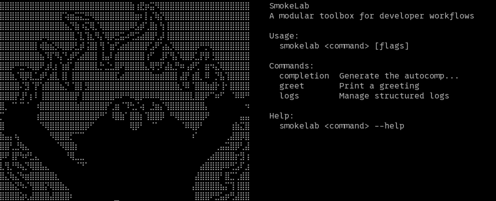

# SmokeLab

> Uma bancada modular de ferramentas para o fluxo de trabalho de desenvolvedores.


SmokeLab e uma aplicacao local-first que reune utilitarios de desenvolvimento em
um unico motor reutilizavel. O projeto foi desenhado para oferecer a mesma regra
de negocio por uma aplicacao desktop e por linha de comando, sem duplicar
comportamento entre interfaces.

O objetivo e tornar tarefas recorrentes, como inspecionar logs, simular servicos
e reproduzir cenarios de integracao, mais simples de executar e manter.

> [!IMPORTANT]
> O SmokeLab esta em desenvolvimento ativo. A ingestao de logs pela CLI ja e
> funcional; a interface desktop e outras ferramentas ainda estao evoluindo.



## Recursos

| Recurso | Estado | Disponibilidade |
| --- | --- | --- |
| Ingestao de logs NDJSON | Funcional | CLI e engine |
| Persistencia local em SQLite | Funcional | Engine |
| Leitura de `stdin`, arquivo e modo `follow` | Funcional | CLI |
| Progresso de ingestao em tempo real | Funcional | CLI |
| Motor de mocks HTTP | Experimental e pausado | Engine |
| Workspace desktop | Em desenvolvimento | GUI |

### Principios do projeto

- **Modular:** ferramentas novas nascem no `engine` e podem ser expostas por
  mais de uma interface.
- **Local-first:** dados e ferramentas executam localmente sempre que possivel.
- **Multi-interface:** GUI e CLI sao adaptadores do mesmo comportamento central.
- **Extensivel:** cada ferramenta pode evoluir sem acoplar o motor a uma camada
  de apresentacao.
- **Testavel:** regras de negocio permanecem independentes de Wails, React ou
  Cobra.

## Arquitetura

O repositorio e organizado em tres pacotes principais:

```text
                    +-----------------+
                    | packages/engine |
                    | regras e fluxos |
                    +--------+--------+
                             ^
                             |
              +--------------+--------------+
              |                             |
      +-------+------+              +-------+------+
      | packages/gui |              | packages/cli |
      | Wails + React|              | Cobra        |
      +--------------+              +--------------+
```

- [`packages/engine`](packages/engine) contem regras de negocio, validacoes,
  processamento, persistencia e comportamentos reutilizaveis.
- [`packages/gui`](packages/gui) contem a aplicacao desktop e adapta servicos do
  `engine` para Wails e React.
- [`packages/cli`](packages/cli) interpreta argumentos, adapta fontes de entrada
  e apresenta resultados no terminal.

As dependencias seguem uma unica direcao: `gui` e `cli` podem depender do
`engine`; o `engine` nao conhece detalhes das interfaces.

```text
.
|-- packages/
|   |-- engine/
|   |   |-- HttpMock/       # motor experimental de mocks HTTP
|   |   |-- logs/           # parsing e fluxo de ingestao
|   |   `-- storage/        # SQLite, repositorios e migracoes
|   |-- gui/                # aplicacao Wails + React + TypeScript
|   `-- cli/                # comandos e adaptadores de terminal
|-- build/                  # configuracoes e artefatos desktop
|-- Makefile
`-- go.mod
```

## Inicio rapido

### Requisitos

Para o `engine` e a CLI:

- Go 1.25 ou uma versao compativel com o [`go.mod`](go.mod).

Para a aplicacao desktop:

- Node.js e npm;
- Wails CLI v2.14.0;
- dependencias nativas de GTK/WebKit em ambientes Linux.

Valide o ambiente desktop com:

```bash
wails doctor
```

Instale a versao do Wails usada pelo projeto caso necessario:

```bash
go install github.com/wailsapp/wails/v2/cmd/wails@v2.14.0
```

### Configuracao

```bash
git clone https://github.com/AntiKevin/SmokeLab.git
cd SmokeLab
go mod download

cd packages/gui
npm ci
cd ../..
```

Execute os testes para confirmar a configuracao:

```bash
make test
```

Abra a tela inicial da CLI:

```bash
go run ./packages/cli
```

## Ingestao de logs

A ferramenta de logs recebe um objeto JSON completo por linha, valida o registro
e o persiste no banco local. Por padrao, cada linha aceita e gravada assim que e
lida.

### Entrada por `stdin`

```bash
cat app.ndjson | go run ./packages/cli logs ingest --stdin
```

Tambem e possivel conectar diretamente a saida de outro processo:

```bash
seu-comando-de-logs | go run ./packages/cli logs ingest --stdin --on-invalid skip
```

### Entrada por arquivo

Leia um arquivo existente uma vez:

```bash
go run ./packages/cli logs ingest --file app.ndjson
```

Acompanhe novas linhas adicionadas ao arquivo:

```bash
go run ./packages/cli logs ingest --file app.ndjson --follow
```

Durante uma execucao interativa, a CLI atualiza o total confirmado pelo
repositorio:

```text
ingesting logs: persisted=8421
ingested: read=10000 accepted=10000 persisted=10000 invalid=0 skipped=0 batches=10000
```

### Formato NDJSON

Cada linha deve conter estes campos:

| Campo | Tipo | Regra |
| --- | --- | --- |
| `timestamp` | string | Data em RFC 3339 |
| `level` | string | Valor nao vazio |
| `message` | string | Valor nao vazio |

Campos adicionais sao preservados em `params` como JSON. Isso permite ingerir
metadados especificos de cada aplicacao sem alterar o schema central.

```json
{"timestamp":"2026-08-22T12:00:00Z","level":"info","message":"request completed","service_name":"payments","duration_ms":42}
```

Pretty-print, sequencias ANSI, chaves sem aspas e objetos divididos em varias
linhas nao fazem parte do formato aceito.

### Opcoes

| Flag | Descricao | Padrao |
| --- | --- | --- |
| `--stdin` | Le de entrada padrao | Desativado |
| `--file <path>` | Le de um arquivo | Desativado |
| `--follow` | Aguarda novas linhas no arquivo | Desativado |
| `--db <path>` | Define o arquivo SQLite | Diretorio de configuracao do usuario |
| `--on-invalid fail\|skip` | Falha ou ignora linhas invalidas | `fail` |
| `--batch-size <n>` | Quantidade de entradas por transacao | `1` |
| `--max-line-bytes <n>` | Limite de bytes por linha | `1048576` |

Use exatamente uma fonte por execucao: `--stdin` ou `--file`. Para consultar a
ajuda atualizada:

```bash
go run ./packages/cli logs ingest --help
```

O banco padrao e `smokelab.db` dentro do diretorio de configuracao do usuario.
Um caminho diferente pode ser informado quando for necessario isolar uma
execucao:

```bash
go run ./packages/cli logs ingest --file app.ndjson --db /tmp/smokelab.db
```

## Aplicacao desktop

Instale as dependencias do frontend antes da primeira execucao:

```bash
cd packages/gui
npm ci
cd ../..
```

Inicie Wails e Vite em modo de desenvolvimento:

```bash
make dev
```

`make run` e um alias para o mesmo comando. Argumentos adicionais podem ser
repassados ao Wails com `ARGS`:

```bash
make dev ARGS="-debug"
```

Para trabalhar apenas no frontend:

```bash
cd packages/gui
npm run dev
```

Nesse modo, bindings de backend gerados pelo Wails nao ficam disponiveis. Use
`make dev` para validar o fluxo desktop completo.

## Comandos de desenvolvimento

| Comando | Acao |
| --- | --- |
| `make dev` | Executa a aplicacao desktop em desenvolvimento |
| `make run` | Alias de `make dev` |
| `make build` | Gera o binario desktop em `build/bin/` |
| `make gui-build` | Compila apenas o frontend |
| `make cli` | Abre a tela inicial da CLI; aceita argumentos em `ARGS` |
| `make test` | Executa todos os testes Go |

Argumentos do `go test` tambem podem ser repassados:

```bash
make test ARGS="-race -count=1"
```

## Adicionando uma ferramenta

Uma nova funcionalidade deve respeitar o fluxo modular do projeto:

1. Implemente modelos, validacoes e regras no `packages/engine`.
2. Cubra o comportamento do `engine` com testes unitarios.
3. Exponha o recurso na CLI e/ou GUI como um adaptador de interface.
4. Mantenha formatacao de terminal, componentes React e APIs Wails fora do
   `engine`.
5. Evite duplicar comportamento entre interfaces.

Consulte [`AGENTS.md`](AGENTS.md) para as regras arquiteturais completas.

## Contribuindo

Contribuicoes sao bem-vindas. Antes de abrir uma alteracao:

1. Leia o [`CONTRIBUTING.md`](CONTRIBUTING.md).
2. Abra ou consulte uma [issue](https://github.com/AntiKevin/SmokeLab/issues)
   para alinhar mudancas maiores.
3. Mantenha a separacao entre `engine`, `gui` e `cli`.
4. Execute `make test` antes de enviar o pull request.
5. Use Conventional Commits e escreva as mensagens de commit em ingles.

## Arquivos gerados

Estes diretorios sao produzidos pelo processo de build ou geracao de bindings:

- `packages/gui/dist`: build estatico do frontend usado pelo Wails;
- `packages/gui/wailsjs`: bindings entre Go e o frontend;
- `build/bin`: binarios desktop gerados por `make build`.

Evite editar bindings gerados manualmente.

## Licenca

Este repositorio ainda nao possui uma licenca publicada. Uma licenca deve ser
definida antes que o projeto seja distribuido como software open source.
